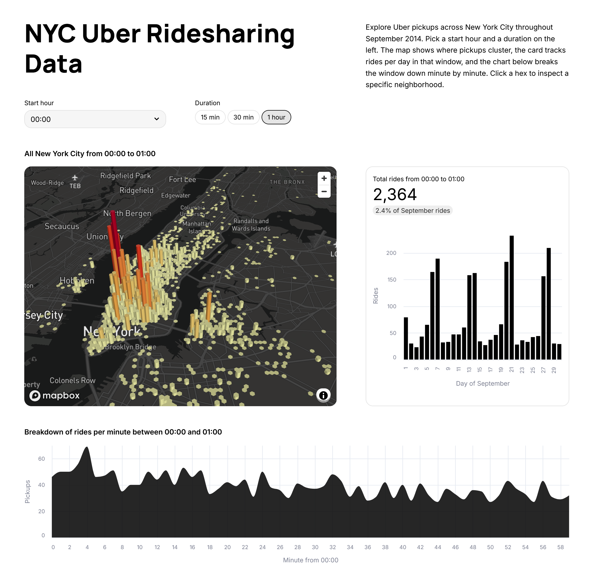

# Streamlit Demo: Uber Pickups in New York City

Rebuilding <https://demo-uber-nyc-pickups.streamlit.app/> with modern Streamlit



## Prerequisites

- [`uv`](https://docs.astral.sh/uv/getting-started/installation/) — Python package and project manager
- [`just`](https://github.com/casey/just#installation) — command runner

## Setup

The map needs a Mapbox token. Copy the example secrets file and fill in your key:

```sh
cp .streamlit/secrets.toml.example .streamlit/secrets.toml
```

Then edit `.streamlit/secrets.toml` and replace `pk.XXX` with a token from <https://account.mapbox.com/access-tokens/>. The file is gitignored.

## Development

Run `just` (no args) to list commands.

| Command        | What it does                                                      |
| -------------- | ----------------------------------------------------------------- |
| `just install` | Install project dependencies with `uv sync`                       |
| `just run`     | Run the Streamlit app                                             |
| `just lint`    | Lint with `ruff check`                                            |
| `just format`  | Reorder imports with `reorder-python-imports`, then `ruff format` |

## Resources

- Uber website: https://www.uber.com
- Uber Base design system: https://base.uber.com

The `.streamlit/config.toml` theme was generated by Claude after reading those two sites.
